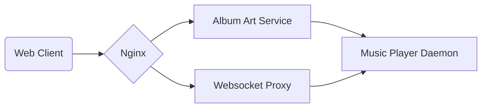

# Remote

Web client for the [Music Player Daemon](https://www.musicpd.org/).


## Local Development

Requirements:
 * docker and docker-compose
 * pipenv
 * python 3.7+

Directories:
 - `fake_mpd` - resources for a local instance of MPD which runs in docker
 - `web` - python & javascript code for the web service
 - `art` - python code for the album art service


### Running a Dev Server

Make the "playlists" directory in `fake_mpd`.

```sh
mkdir fake_mpd/playlists
```

Build the web bundle in "dev" mode. "Dev mode" uses "webpack --watch" to reload the bundle when a change in the source is detected:

```sh
cd web/frontend && yarn build-dev
```

Run the full service with docker-compose:

```sh
docker-compose up --force-recreate
```

Navigate to `localhost`.

## Architecture



### Components

* The **album art service** provides album cover images stored in the music library to web clients.
* The **websocket proxy** is an adapter to the MPD to allow web clients to interact with it via the [mpd protocol](musicpd.org/doc/html/protocol.html), enabling:
  * commands & queries
  * a websocket interface for MPD's `idle` command